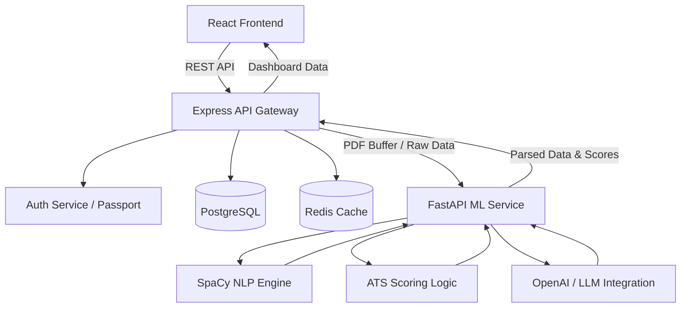

<div align="center">
  <h1>🚀 Career AI: Resume Analytics & Career Recommender</h1>
  <p><strong>Intelligent AI-powered career intelligence platform with ATS scoring, skill gap analysis, and personalized career pathways.</strong></p>

  [](https://react.dev/)
  [](https://nodejs.org/)
  [](https://fastapi.tiangolo.com/)
  [](https://www.postgresql.org/)
  [](https://redis.io/)
</div>

---

## 📌 Professional Overview
**Career AI** is a production-grade microservices-based career intelligence platform. It bridges the gap between job seekers and the modern ATS (Applicant Tracking System) environment. The platform intelligently parses resumes, extracts core skills via Natural Language Processing (NLP), and recommends personalized career trajectories using vector-based skill matching. 

A built-in AI assistant helps users prepare for interviews, answers career queries, and guides them on optimizing their resumes based on real-time market data.

---

## ❗ Problem Statement
Job seekers frequently struggle to get past automated Applicant Tracking Systems (ATS) due to poor resume formatting, lack of target keywords, and generalized skill presentation. Furthermore, candidates lack personalized insights into skill gaps preventing them from transitioning into higher-level roles. Manual resume reviews are slow, biased, and generic.

---

## ✨ Features
- **Intelligent Resume Parsing:** Native PDF extraction using Python and SpaCy NLP models.
- **ATS Health Scoring:** Automated evaluation of resume structure, keyword density, and formatting.
- **Semantic Skill Extraction:** Contextual skill extraction to identify both hard technical skills and soft skills.
- **Personalized Career Onboarding:** Define career goals, target companies, and remote work preferences to tailor the dashboard experience.
- **AI Career Chatbot:** Conversational assistant for interview prep, HR questions, and dynamic career guidance.
- **OAuth Authentication:** Secure JWT-based authentication combined with Google/GitHub OAuth integrations.
- **Real-Time Analytics Dashboard:** Visual skill gaps, resume progression metrics, and predictive job matches.

---

## 🛠️ Tech Stack

### Frontend Architecture
- **Framework:** React 19 (via Vite)
- **State Management:** Redux Toolkit (`@reduxjs/toolkit`)
- **Styling:** Tailwind CSS (with Forms, Typography, Aspect-Ratio plugins)
- **PDF Rendering:** `react-pdf`
- **Routing:** React Router v7

### Backend Microservices
- **Server Environment:** Node.js & Express.js
- **Database:** PostgreSQL (with raw PG pooling & transaction safety)
- **Caching & Queues:** Redis (for caching & future job queuing)
- **Authentication:** Passport.js (JWT, Google OAuth, GitHub OAuth)
- **File Uploads:** Multer (with limits & extension validation)

### Machine Learning / AI Services
- **Framework:** Python & FastAPI
- **NLP & AI:** SpaCy, Scikit-learn, Pandas, OpenAI API
- **Model Deployment:** Uvicorn (ASGI web server)

---

## ⚙️ Architecture / Workflow



---

## 📂 Folder Structure

```bash
Ai-Powered-Resume-Analysis/
├── career-ai-backend/          # Express.js API & Database Logic
│   ├── src/                    # Controllers, Services, Mappers, Routes
│   ├── prisma/                 # ORM/Schema (if integrated later)
│   ├── migrations/             # SQL DB Migrations
│   ├── uploads/                # Temporary local storage for resumes
│   └── package.json            
├── career-ai-frontend/         # React + Vite Client
│   ├── src/                    # React Components, Redux Slices, Hooks
│   ├── public/                 # Static assets
│   ├── tailwind.config.js      # Styling configuration
│   └── vite.config.js          
└── career-ai-ml-services/      # Python AI/ML Microservice
    ├── app.py / main.py        # FastAPI Application Entry
    ├── modules/                # Skill extraction, parsing scripts
    ├── data/                   # ML training datasets
    └── requirements.txt        
```

---

## 🚀 Installation & Setup

### Prerequisites
- Node.js (v18.0+)
- Python (3.10+)
- PostgreSQL (running locally or in the cloud)
- Redis (optional, for caching)

### 1. Database Setup
Ensure PostgreSQL is running. Create a new database:
```sql
CREATE DATABASE career_ai_db;
```

### 2. Machine Learning Service (FastAPI)
```bash
cd career-ai-ml-services
python -m venv venv
source venv/bin/activate  # On Windows: venv\Scripts\activate
pip install -r requirements.txt
uvicorn main:app --reload --port 8001
```

### 3. Backend Setup (Node.js)
```bash
cd career-ai-backend
npm install
# Copy env file and fill values
cp .env.example .env 
npm run dev
```

### 4. Frontend Setup (React/Vite)
```bash
cd career-ai-frontend
npm install
# Configure your VITE_BACKEND_URL in .env
npm run dev
```

---

## 🔐 Environment Variables

### Backend (`career-ai-backend/.env`)
```ini
NODE_ENV=development
PORT=5000
DB_HOST=localhost
DB_PORT=5432
DB_NAME=career_ai_db
DB_USER=postgres
DB_PASSWORD=yourpassword

JWT_SECRET=your-super-secret-jwt-key
JWT_EXPIRE=7d

REDIS_HOST=localhost
REDIS_PORT=6379

# AI Microservices
AI_PARSER_URL=http://localhost:8001
OPENROUTER_API_KEY=your_openrouter_key

# OAuth Integrations
GOOGLE_CLIENT_ID=your_google_client_id
GOOGLE_CLIENT_SECRET=your_google_client_secret
```

### Frontend (`career-ai-frontend/.env`)
```ini
VITE_BACKEND_URL=http://localhost:5000
```

---

## 🔌 API Endpoints Table

| Category | Method | Endpoint | Description | Auth Required |
|----------|--------|----------|-------------|:---:|
| **Auth** | POST | `/api/v1/auth/login` | Email/Password Login | ❌ |
| **Auth** | POST | `/api/v1/auth/signup` | Register new user | ❌ |
| **Auth** | POST | `/api/v1/auth/oauth` | Google/GitHub SSO login | ❌ |
| **Auth** | GET | `/api/v1/auth/me` | Fetch active user session | ✅ |
| **Onboarding** | POST | `/api/v1/onboarding/career-goal` | Save target career data | ✅ |
| **Onboarding** | POST | `/api/v1/onboarding/resume` | Upload PDF Resume (Multer) | ✅ |
| **Dashboard** | GET | `/api/v1/dashboard` | Fetch ATS, skill gaps, & metrics | ✅ |
| **Dashboard** | GET | `/api/v1/dashboard/quick-stats` | Fetch lightweight navbar stats | ✅ |
| **Chat** | POST | `/api/v1/chat/message` | Send prompt to AI Interview bot | ✅ |
| **Chat** | GET | `/api/v1/chat/suggestions` | Get contextual prompt suggestions | ✅ |

### Example Request (Career Goal)
```json
POST /api/v1/onboarding/career-goal
{
  "targetRole": "senior-software-engineer",
  "experienceLevel": "mid",
  "targetCompanies": ["Google", "Microsoft"],
  "location": "India",
  "remotePreference": "flexible"
}
```

---

## 🤖 Machine Learning Workflow
The AI service is decoupled to isolate heavy NLP processing from the main transactional web server.
1. **Resume Ingestion:** PDF buffer is received by FastAPI.
2. **Layout Parsing:** Extracts logical sections (Experience, Education, Skills) preserving context.
3. **NLP Extraction:** Spacy models identify domain-specific terminology (e.g. `React`, `Python`, `Agile`).
4. **Vector Matching:** Recommender algorithms match extracted vectors against known job description vectors.
5. **Scoring:** ML models generate a JSON dictionary of `formatting_score`, `experience_score`, and missing skills.

---

## ⚡ Performance / Optimization Highlights
- **Transaction Safety:** Multi-step database writes (like saving a resume, extracting skills, and creating a log) are wrapped in `BEGIN` / `COMMIT` blocks to prevent dirty reads.
- **Asynchronous AI Calling:** The system connects with AI Services outside the Postgres transaction scope, ensuring DB connections are not held hostage by external HTTP latency.
- **Bulk Insertions:** Uses Postgres `unnest($3::text[])` for array operations to avoid N+1 query performance degradation.
- **Parallel Fetching:** Employs `Promise.all` across the Dashboard services to concurrently query multiple metrics.

---

## 🚢 Deployment Instructions
The application is designed for cloud-native deployments.

### Frontend Deployment (Vercel)
The `vercel.json` ensures single-page application routing behaves correctly:
```json
{
  "rewrites": [{ "source": "/(.*)", "destination": "/index.html" }]
}
```
Deploy via Vercel CLI or connect the GitHub repository directly to Vercel.

### Backend & ML Service Deployment (Render / Railway)
- Use the provided `render.yaml` inside `career-ai-ml-services` to orchestrate FastAPI.
- Node.js Backend can be deployed via Docker or directly as a Web Service on Render with environment variables mapped to managed PostgreSQL/Redis instances.

---

## 📄 License
This project is open-source and available under the **MIT License**.

---

<div align="center">
  🌟 <i>Empowering the next generation of engineers with AI-driven career guidance</i> 🌟
</div>
